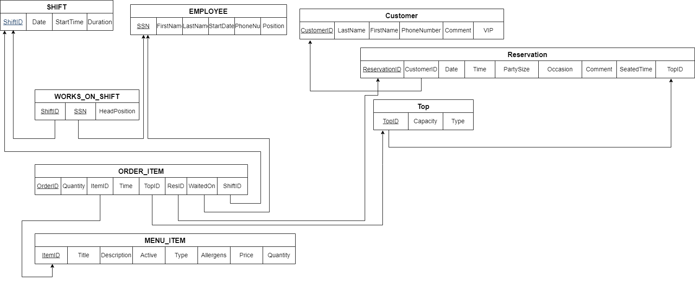

# CSCI 601 - Spring 2024 - Citadel

This is the shared project for "TheBestDBEver" group.

## Requirements Documents

[PDF of Phase 1](<Documentation/601- DB Project - The Best DB Ever.pdf>)

[PDF of Phase 2](<Documentation/601- DB Project - The Best DB Ever - Phase Two.pdf>)

## Logical Schema

## Order of how the scripts should be run
First Run the Schema Script
Then run the rest of these scripts in this order: insert.sql, Insert_works_on.sql, InsertTop.sql, MenuItem.sql, InsertReservation.sql, InsertOrder.sql
